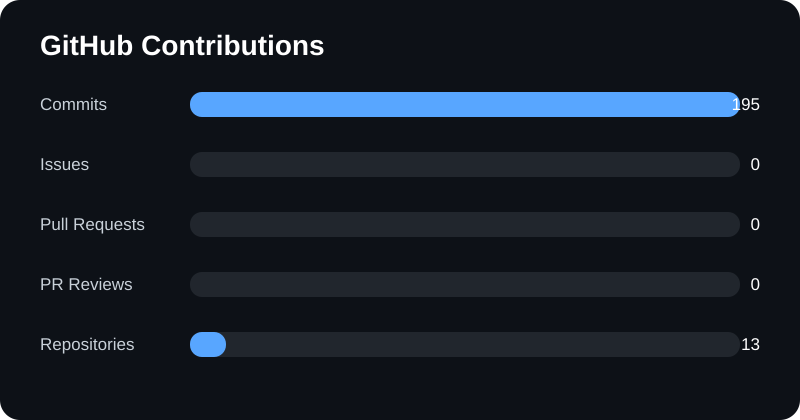
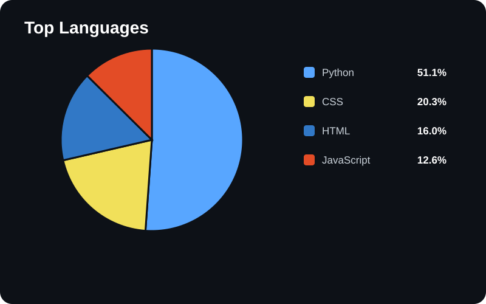

## Hi there 👋 Engr. Who here!

<h3 align="center">
  ✨ Welcome to my GitHub ✨
</h3>

<p align="center">
  
</p>

<p align="center">
  
</p>

---

## 👩‍💻 Introduction

```python
class Pragya:
    def __init__(self):
        self.name = "Pragya"
        self.alias = "Engr. Who"
        self.role = "AIML Enthusiast"
        self.location = "India"
        self.philosophy = "I design and build whatever I like and imagine"
        self.fuel = "Coffee — helps me think faster at night and squash bugs"
        self.current_project = "CHAYA — a high-level language, easier than Python, but vast"

    def say_hi(self):
        print("Thanks for stopping by my profile! 👋")


pragya = Pragya()
pragya.say_hi()
```
---

##### FunFacts:
-> I like both tea and coffee.

-> Watch anime and marvel movies are my fav works.

-> Hobbies: anime, marvel, music, writting, drawing

---

##### 🛠️ Tech Stack

<p>

</p>


<p align="center">
  
</p>

<p align="center">
  ☕ <i>Fueled by coffee & code</i> 💻
</p>

###### Languages
<p>
  
</p>

###### Web Development
<p>
  
</p>

###### AI / ML
<p>
  
</p>

###### Tools
<p>
  
</p>

---

##### 🔭 Currently Exploring

<table>
  <tr>
    <td>🤖 <b>Machine Learning</b></td>
  </tr>
  <tr>
    <td>🧠 <b>Generative AI</b></td>
  </tr>
  <tr>
    <td>⚡ <b>Advanced Python</b></td>
  </tr>
  <tr>
    <td>☁️ <b>Cloud & AI</b></td>
  </tr>
  <tr>
    <td>📚 <b>AI/ML Research</b></td>
  </tr>
</table>

---

##### 📊 Most Used Languages

| Language | Usage |
|----------|-------|
| 🐍 **Python** | 60% |
| ☕ **Java** | 15% |
| 🔧 **C++** | 10% |
| 🌐 **JavaScript** | 10% |
| 🎨 **Other** | 5% |

---  

##### Snake Icon

<p align="center">
  <picture>
  <source media="(prefers-color-scheme: dark)" srcset="https://raw.githubusercontent.com/EngrWho2006-debug/EngrWho2006-debug/output/github-contribution-grid-snake-dark.svg" />
  <source media="(prefers-color-scheme: light)" srcset="https://raw.githubusercontent.com/EngrWho2006-debug/EngrWho2006-debug/output/github-contribution-grid-snake.svg" />
  
</picture>
</p>

---

##### Featured Project 

###### 🌙 CHAYA — My Own Programming Language

CHAYA is a programming language created from scratch to explore how programming languages work under the hood. I built it with a focus on simple syntax, readability, and learning through implementation.

🔹 Built With: Python

🔹 Type: Interpreted Programming Language

🔹 Status: Active Development

💡 Why I Built CHAYA

Instead of only learning programming languages, I wanted to understand how a programming language is actually built — from parsing commands to executing them.

CHAYA is my experiment in turning that curiosity into a real project.

«"Don't just learn a language. Build one."»

🔗 [View CHAYA on GitHub](https://github.com/EngrWho2006-debug/Chaya)

---

##### Projects Overview

<!-- PROJECTS START -->
## My Projects

- **[EngrWho2006-debug](https://github.com/EngrWho2006-debug/EngrWho2006-debug)** - No description
- **[Chaya](https://github.com/EngrWho2006-debug/Chaya)** - A new programming language which is easier than Python
- **[PRODIGY_WD_02](https://github.com/EngrWho2006-debug/PRODIGY_WD_02)** - A mini stopwatch web application
- **[PRODIGY_WD_01](https://github.com/EngrWho2006-debug/PRODIGY_WD_01)** - A responsive landing page project
- **[PRODIGY_WD_03](https://github.com/EngrWho2006-debug/PRODIGY_WD_03)** - A simple tic tac toe game
- **[E--commerce-Shopping-Cart-app](https://github.com/EngrWho2006-debug/E--commerce-Shopping-Cart-app)** - An online shopping app
- **[Calendar-and-Reminder-App](https://github.com/EngrWho2006-debug/Calendar-and-Reminder-App)** - A small reminder app
- **[Basic-Calculator](https://github.com/EngrWho2006-debug/Basic-Calculator)** - Basic GUI Calculator
- **[Coffee-Toggle](https://github.com/EngrWho2006-debug/Coffee-Toggle)** - Coffee Toggle UI animation
- **[My-Portfolio](https://github.com/EngrWho2006-debug/My-Portfolio)** - Welcome to my personal portfolio website.

<!-- PROJECTS END -->

---

##### Chart and Table

<h2 align="center">📊 GitHub Stats</h2>

<p align="center">
  
</p>


  






---


##### 🔗 Connect With Me


<p align="center">

<a href="[https://yourportfolio.vercel.app](https://my-portfolio-one-mu-22.vercel.app/)" target="_blank">
  
</a>

<a href="https://github.com/EngrWho2006-debug" target="_blank">
  
</a>

<a href="https://www.linkedin.com/in/pragya-s-141824317/" target="_blank">
  
</a>

<a href="https://leetcode.com/u/PragyaSingh16/" target="_blank">
  
</a>

<a href="mailto:singhpragya1682006@gmail.com">
  
</a>

</p>

---

##### Quotes

<p align="center">
  <i>"The only way to do great work is to love what you do."</i>
  <br>
  <b>— Steve Jobs </b>
</p>

---

##### Personal Vision

«“I want to build technology that doesn't just solve problems, but creates possibilities.”»

My vision is to keep learning, building, and experimenting at the intersection of Artificial Intelligence, creativity, and software engineering.
I want to turn ideas into meaningful projects, keep pushing my limits, and create something that people can genuinely use and remember.

Learn → Build → Fail → Improve → Create ✨

---

##### Currently Vibing

> ☕ Building things, breaking things, and learning how to fix them.

<p align="center">
  
</p>

<p align="center">
  <i>“Code. Create. Learn. Repeat.”</i>
</p>

<!-- pacman -->
<picture>
    <source media="(prefers-color-scheme: dark)" srcset="https://raw.githubusercontent.com/EngrWho2006-debug/EngrWho2006-debug/output/pacman-contribution-graph-dark.svg">
    <source media="(prefers-color-scheme: light)" srcset="https://raw.githubusercontent.com/EngrWho2006-debug/EngrWho2006-debug/output/pacman-contribution-graph.svg">
    
</picture>

<p align="center">
  ──────────────── ✦ ────────────────
</p>

<p align="center">
  ⭐ Thanks for visiting my profile!
</p>

<!--
**EngrWho2006-debug/EngrWho2006-debug** is a ✨ _special_ ✨ repository because its `README.md` (this file) appears on your GitHub profile.

Here are some ideas to get you started:

- 🔭 I'm currently working on ...
- 🌱 I'm currently learning ...
- 👯 I'm looking to collaborate on ...
- 🤔 I'm looking for help with ...
- 💬 Ask me about ...
- 📫 How to reach me: ...
- 😄 Pronouns: ...
- ⚡ Fun fact: ...
-->
